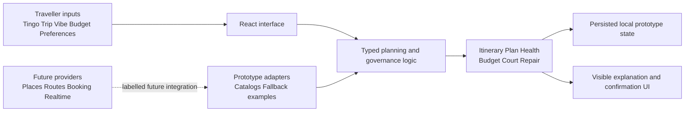

# CocoCrunch

<p align="center">
  <b>A transparent travel-planning companion for turning group preferences, budgets, and disruptions into a plan everyone can stand behind.</b>
</p>

<p align="center">
  
  
  
  
</p>

> **Submission links to complete before handing in**
>
> | Material | Link | Final check |
> | --- | --- | --- |
> | Public GitHub repository | [github.com/meishuet16/CocoCrunch_GO](https://github.com/meishuet16/CocoCrunch_GO) | Confirm it opens while logged out. |
> | Video presentation | **[add YouTube Unlisted link]** | 3–5 minutes; title with the team name only. |
> | Presentation slides | **[add public link]** | Link the final version, not an editor-only draft. |
> | Ideation boards | **[add public board or image links]** | Add a caption under each board. |
> | UI prototype | **[add public Figma, Canva, Netlify, or Vercel link]** | Test in an incognito/private window. |

**Team:** [Add member names]<br>
**Track:** Lifestyle Track — Planning an Escape<br>
**Problem statement:** Travel Planner

## Table of Contents

- [1. Project Overview](#1-project-overview)
- [2. Ideation and Process](#2-ideation-and-process)
- [3. Design and Prototype](#3-design-and-prototype)
- [4. What Makes CocoCrunch Different](#4-what-makes-cococrunch-different)
- [5. Technical Architecture and Feasibility](#5-technical-architecture-and-feasibility)
- [How to Run Locally](#how-to-run-locally)
- [Video Presentation](#video-presentation)
- [Team Contributions](#team-contributions)
- [Submission Checklist](#submission-checklist)

---

## 1. Project Overview

### The problem

Group trips usually die a slow death in a group chat. One person wants the entire itinerary confirmed weeks in advance, another only wants to decide on the day, and nobody wants to say that a friend’s must-see museum will not fit. Budgets, pacing, accessibility needs, and non-negotiable plans live in people’s heads rather than in the itinerary. Disagreement therefore appears late—often after bookings are made—and one delay can force someone to rebuild the day manually while trying not to lose the reservation everyone cared about.

The problem affects solo travellers as well as groups, but it becomes more difficult when friends or family have different needs. The key stakeholders are:

- **Travellers**, who need one understandable plan that reflects their priorities.
- **Group members**, who need a fair way to express preferences and resolve disagreements.
- **Trip organisers**, who currently carry the invisible work of coordinating budget, timing, and changes.
- **Family or trusted contacts**, who may want reassurance without requiring continuous location tracking.

Existing itinerary tools such as [TripIt](https://www.tripit.com/web) are useful for consolidating booking confirmations into an itinerary. However, they largely begin after a group has agreed what to book. CocoCrunch focuses on the earlier and messier planning stage: turning individual preferences, trade-offs, and disagreements into a plan the group explicitly accepts, then helping the group recover when reality changes.

### Our solution

CocoCrunch is a mobile-first travel-planning prototype that converts everyone’s individual preferences into one transparent, workable trip plan. It brings together trip setup, itinerary generation, budget planning, group decision-making, disruption repair, and post-trip learning. Its companion, Coco, provides a consistent, friendly guide through the journey rather than acting as an opaque automation layer.

The product’s central promise is simple: **a recommendation may help, but it never quietly takes control.** A user can see why a suggestion fits, a group can vote before an official plan changes, and a disruption repair shows what will be affected before anyone confirms it.

For example, imagine a flight delay shifts the group’s arrival by 90 minutes. CocoCrunch does not silently rewrite the itinerary. It protects the dinner reservation that the group has already agreed is essential, presents a recovery option with time, cost, and preference effects, and—for a group trip—routes the decision through the appropriate approval flow. Where a previous decision produced a viable losing option, that option can become a Backup Plan candidate rather than introducing an unexplained new recommendation.

### Core features

| Feature | What it solves | Current prototype behaviour |
| --- | --- | --- |
| **Tingo travel profile** | Generic itineraries ignore how different people like to travel. | A 16-type assessment informs pace, recommendation bias, and budget guidance. |
| **Solo and group trip setup** | Trip context is normally scattered across messages and notes. | Captures destination, dates, Trip Vibe, budget, Must-Go anchors, Deal Breakers, and preferences. |
| **Group Travel DNA** | Group preferences are often reduced to the loudest voice. | Surfaces shared signals, budget ranges, and visible conflicts without inventing missing member preferences. |
| **Group Court** | One person can otherwise change a shared plan without consent. | Supports proposals, voting, concessions, confirmed decisions, and tie-only Gacha. |
| **Plan Health and evidence** | Itineraries can look attractive while being unrealistic. | Explains constraints, protected anchors, buffers, and planning risks. |
| **Budget and retrospective** | Planned cost and actual cost are rarely compared. | Tracks category budgets, planned-versus-actual values, and decision reflection. |
| **Disruption repair** | A delay or change forces manual replanning under pressure. | Provides a preview, explicit confirmation where needed, and undo. |
| **Travel and memory tools** | Planning usually ends once the itinerary is created. | Includes packing, check-ins, privacy controls, locally scoped safety suggestions, and post-trip memories. |

### Product principles

1. **AI suggestions are proposals, not execution.** Important changes need an explanation, preview, confirmation, and, where appropriate, undo.
2. **Must-Go items are protected anchors.** They cannot be silently replaced by a recommendation.
3. **Group governance stays explicit.** Personal saved ideas are separate from changes to the official group plan.
4. **Randomness has a narrow role.** Gacha is for a true Group Court tie or low-stakes everyday indecision, not official governance by default.
5. **Privacy is intentional.** Family reassurance is separated from location sharing, and continuous location is not enabled by default.
6. **Prototype boundaries are honest.** Demo catalogs, fallback examples, and unavailable external services are labelled rather than presented as live data.

---

## 2. Ideation and Process

### 2.1 Ideas we considered

The project began with the broad question, “Why does planning a group trip still feel like managing several disconnected apps and a chat?” We explored more than a single itinerary screen before selecting the current direction.

| Idea | Decision | Why |
| --- | --- | --- |
| Shared trip-planning workspace | Kept | It brings destinations, constraints, itinerary, budget, and decisions into one journey. |
| Tingo profile and Group Travel DNA | Kept | It makes individual preferences visible before they become conflict. |
| Group Court decision flow | Kept | It makes shared-plan changes accountable instead of letting one person silently edit the itinerary. |
| Backup Plan and disruption repair | Kept | It directly addresses the problem statement’s requirement to adapt when plans change. |
| Generic AI-generated itinerary only | Dropped | It would create suggestions but not solve coordination, consent, or accountability. |
| Random Gacha for official decisions | Dropped as a primary mechanism | Randomness is appropriate only for a genuine tie or low-stakes choice; it must not replace group consent. |
| Continuous location tracking | Dropped as a default | Reassurance should not require surveillance. Manual check-ins and location permissions are separate. |
| Social travel feed as the main product | Dropped | Inspiration is useful, but the core problem is planning and recovering as a group. |

The final concept combines planning intelligence with a deliberate social contract: inputs remain attributable, disagreements stay visible, and official changes require a clear decision path.

### 2.2 Ideation boards

Add the team’s actual boards in this section. Judges are looking for evidence of exploration, refinement, and the journey from raw ideas to the selected solution—not a perfect-looking board.

| Board | Insert image or link | What the reviewer should see |
| --- | --- | --- |
| Problem map / mindmap | **[add image or public link]** | The planning pain points: fragmented information, conflicting preferences, budget uncertainty, and disruption stress. |
| Idea exploration / crazy eights | **[add image or public link]** | Alternative directions considered, including ideas that were dropped. |
| Affinity map or problem tree | **[add image or public link]** | How individual complaints were grouped into core needs and design opportunities. |
| Selected user flow | **[add image or public link]** | The path from trip setup to a group decision and disruption recovery. |

Suggested Markdown image format:

```md

*This board maps the planning pain points that led us to prioritise preference visibility and group consent.*
```

### 2.3 Mentor consultation

Before submitting, record actual mentor feedback here. A strong entry includes the advice, the decision taken, and evidence of the resulting change. It is acceptable to disagree with feedback when the team explains why.

| Mentor feedback | Our response | Evidence to link or show |
| --- | --- | --- |
| **[Add actual feedback]** | **[Explain what changed, or why the team chose another direction]** | **[Link to screen, board, or commit]** |
| **[Add actual feedback]** | **[Explain what changed, or why the team chose another direction]** | **[Link to screen, board, or commit]** |

---

## 3. Design and Prototype

**UI prototype:** **[add public Figma, Canva, Netlify, or Vercel link]**

Before submission, open this link in an incognito/private browser window. A reviewer must be able to access it without requesting permission or logging in.

### End-to-end prototype journey

```text
Trip intent and Tingo profile
        ↓
Solo or group setup
        ↓
Member preferences and Group Travel DNA
        ↓
Itinerary, protected anchors, budget, and Plan Health
        ↓
Group Court confirmation for shared changes
        ↓
Travel check-ins and disruption repair
        ↓
Completed-trip budget, decision, and memory reflection
```

### Key screens to show

Use 4–8 screenshots in the final submission. Each one should have a short caption explaining the interaction or decision it demonstrates.

| Screen | What to demonstrate | Suggested caption focus |
| --- | --- | --- |
| Tingo assessment / trip setup | How a trip starts with real preferences rather than a generic destination search. | “Inputs that shape the plan.” |
| Group Travel DNA | Shared preferences, unresolved conflict, and what is still pending from a member. | “Conflict is visible, not averaged away.” |
| Itinerary and Plan Health | Must-Go anchors, buffers, source evidence, and feasibility. | “A plan explains why it fits.” |
| Group Court | A group proposal, votes, and confirmation. | “Official changes require group consent.” |
| Tie-only Gacha | The controlled use of chance after a true tie. | “Randomness is not the default decision-maker.” |
| Budget / planned versus actual | Budget categories and post-trip reflection. | “Planning learns from actual outcomes.” |
| Disruption repair | What changes, what stays protected, and the confirmation/undo affordance. | “Recovery without silent rewrites.” |
| Check-in / privacy / memories | Reassurance without default location tracking, then reflection. | “Travel support continues after the itinerary.” |

### Visual direction

CocoCrunch uses a warm travel-journal and scrapbook direction instead of a generic dashboard. Cream paper surfaces, Sangria accents, postcard-like badges, maps, and Coco’s context-aware poses make the planning experience feel personal while preserving readable controls and clear states. The design deliberately keeps decision-critical information—status, budget, approval state, and plan impact—more prominent than decoration.

---

## 4. What Makes CocoCrunch Different

Take one moment from a group trip: the plan says everyone is heading to a rooftop dinner at 7:00 PM, but a flight lands 90 minutes late. With a shared document or group chat, someone usually makes a rushed change and hopes everyone agrees. CocoCrunch treats that situation as a transparent decision.

| Common group-planning problem | Typical workaround | CocoCrunch’s approach |
| --- | --- | --- |
| Preferences are buried in chat | The organiser remembers what each person wanted. | Tingo, explicit preference inputs, and Group Travel DNA keep the evidence visible. |
| A person changes the shared plan | The group finds out after the itinerary has moved. | Official group changes are proposed and governed through Group Court. |
| A tie becomes an argument or arbitrary choice | Someone decides, or the group stalls. | Gacha appears only for a genuine unresolved tie; its result remains a proposal until confirmed. |
| A delay breaks the day | The organiser rebuilds the plan manually under time pressure. | Repair previews time, cost, and preference impact while protecting anchors. |
| A replacement is unexplained | A fresh suggestion appears with no group context. | Backup candidates can retain the history and support of options previously considered by the group. |
| Family wants an update | Travellers feel pressured to share constant location. | Reassurance check-ins are separated from location permissions. |

### Novelty in the product model

- **Preference provenance:** CocoCrunch does not pretend an unassessed group member has the same profile as another user. Unknown inputs remain pending rather than being filled with assumptions.
- **Governed collaboration:** Saving an idea and changing the official itinerary are different actions. This distinction makes group planning more trustworthy.
- **Recovery as a decision, not a notification:** The app shows the trade-off of a repair before it happens and provides undo for reversible changes.
- **A travel companion with boundaries:** Coco adds explanation and character, but it does not claim live knowledge or make hidden decisions.
- **Honest prototype UX:** Local catalogs, prices, maps, parsing, and provider-dependent features explain their current limitation instead of simulating real data silently.

---

## 5. Technical Architecture and Feasibility

### Current architecture



The current prototype is intentionally frontend-first. The app uses local, versioned browser persistence for durable prototype state, and core planning behaviours are implemented as typed logic rather than hidden inside display components. This makes decisions such as Group Court eligibility, protected anchors, budget calculations, and repair previews testable and easier to replace with real providers later.

### Tech stack

| Area | Current prototype | Why it fits | Production direction |
| --- | --- | --- | --- |
| Frontend | React, TypeScript, Vite | Fast, typed, component-based development for a responsive prototype. | Retain React/TypeScript; deploy as a static web app. |
| Interaction | dnd-kit, Lucide React, uisfx | Supports direct manipulation, recognisable controls, and lightweight feedback. | Continue with accessibility and mobile interaction testing. |
| Planning logic | Typed TypeScript modules | Keeps itinerary, budget, group-governance, and repair rules deterministic and testable. | Move shared authoritative decisions to server-side services. |
| Persistence | Browser local persistence | Allows a self-contained demo with state preserved between sessions. | Add authenticated accounts, database storage, and access policies. |
| Photo metadata | exifr with local prototype handling | Supports photo-memory experiments while avoiding claims of a remote upload or EXIF provider. | Add explicit consent, secure storage, and server processing where needed. |
| Testing and build | TypeScript, Vitest, Vite production build | Validates types, behaviour, and build readiness through `npm run check`. | Add end-to-end, provider-contract, and accessibility regression coverage. |

### Honest prototype boundary

The present version does **not** connect to live booking inventory, payments, real-time group chat, live traffic, continuous GPS tracking, or a live map/provider API. Local catalogs, demo prices, fallback examples, and prototype parsing are labelled in the interface. This is intentional: the submission demonstrates product logic and interaction design without representing sample data as a real travel service.

### Feasible production roadmap

| Phase | Scope | Why it is realistic |
| --- | --- | --- |
| **1. Account and trip foundation** | Authentication, trips, membership roles, and database-backed persistence. | Replaces local-only state without changing the established planning flows. |
| **2. Collaboration and governance** | Real-time proposals, votes, comments, decision history, and server-authorised group changes. | Builds on the existing typed Group Court model and keeps shared decisions auditable. |
| **3. Travel data integrations** | Places, routes, weather, and travel-provider links through a secure backend proxy. | Provider failures can retain labelled fallbacks rather than breaking planning. |
| **4. Booking and sharing** | Deep links, booking handoff, optional notifications, and consent-based sharing. | Avoids handling payments in the first production release. |
| **5. Learning and personalisation** | Opt-in learning from confirmed post-trip feedback. | Uses explicit feedback rather than opaque behavioural tracking. |

### Scope discipline

For this prototype, the team chose to build a coherent end-to-end journey rather than claim a large number of live integrations. The demo scope is:

1. Gather trip intent, personal constraints, budgets, and group preferences.
2. Generate and explain a proposed itinerary with protected anchors and Plan Health.
3. Support transparent group decisions, backup options, and disruption repair.
4. Track budget outcomes, check-ins, and completed-trip learning.
5. Describe a credible path to authentication, real-time collaboration, and provider integration without pretending those services already exist.

---

## How to Run Locally

### Prerequisites

- Node.js 18 or later
- npm

### Install and start

```bash
git clone https://github.com/meishuet16/CocoCrunch_GO.git
cd CocoCrunch_GO
npm install
npm run dev
```

Open the local URL printed by Vite, usually `http://localhost:5173`.

### Validate the project

```bash
npm run check
```

This command runs TypeScript validation, the Vitest suite, and a Vite production build.

### Project structure

```text
src/
├── components/      # Screens, drawers, shared UI, and feature-specific tests
├── domain/          # Typed planning, governance, budget, and repair rules
├── motion/          # Interaction sequencing and reduced-motion support
├── persistence.ts   # Versioned local prototype state
├── experience.ts    # Typed interaction-event boundary
├── AppRescued.tsx   # Active app composition and journey orchestration
└── styles.css       # Shared design tokens and global presentation rules
```

---

## Video Presentation

**Duration:** 3–5 minutes. Aim for about 4 minutes 30 seconds and do not exceed 5 minutes.<br>
**Platform:** YouTube, set to **Unlisted**. Title the video with the **team name only**.

### Suggested 4½-minute outline

| Time | Content |
| --- | --- |
| 0:00–0:35 | State the group-travel problem and who is affected. |
| 0:35–1:05 | Introduce CocoCrunch’s promise: transparent preference-based planning and governed group changes. |
| 1:05–3:25 | Demonstrate the key journey: setup → Group Travel DNA → itinerary/Plan Health → Group Court → disruption repair. |
| 3:25–4:05 | Show budget reflection, privacy-respecting check-in, or memory/learning flow. |
| 4:05–4:30 | Explain the technical architecture, honest prototype boundaries, and next production phase. |

Do not spend the video explaining every ideation board. The README is the right place for ideation, mentor feedback, and evolution; the video should make the product and its value immediately clear.

---

## Team Contributions

Complete this table with the team’s actual work before submission. Be specific and make sure every person’s contribution is visible in the repository, prototype, research, or presentation materials.

| Team member | Role | Contributions |
| --- | --- | --- |
| **[Name]** | **[Role]** | [Implemented/designed/researched/presented specific work.] |
| **[Name]** | **[Role]** | [Implemented/designed/researched/presented specific work.] |
| **[Name]** | **[Role]** | [Implemented/designed/researched/presented specific work.] |
| **[Name]** | **[Role]** | [Implemented/designed/researched/presented specific work.] |

---

## Submission Checklist

- [ ] GitHub repository is public and opens while logged out.
- [ ] README has final team names, roles, and verified live links.
- [ ] YouTube presentation is Unlisted, 3–5 minutes, and titled with the team name only.
- [ ] Presentation slides have a public link and are linked at the top of this README.
- [ ] Ideation boards are embedded or publicly linked, with captions that explain their purpose.
- [ ] Mentor feedback is recorded with the team’s response and evidence of iteration.
- [ ] Prototype link opens in an incognito/private browser window.
- [ ] Four to eight key prototype screens are embedded or linked with captions.
- [ ] The live demo and README use the same names, claims, and prototype-boundary disclosures.
