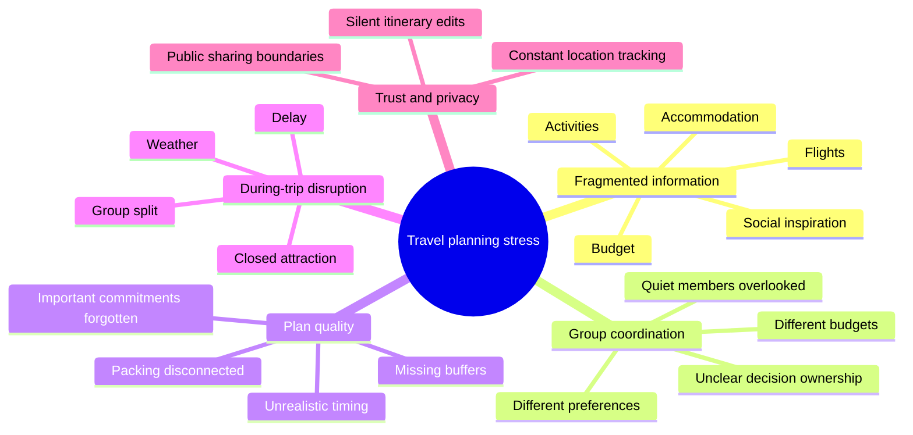
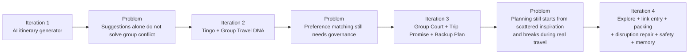
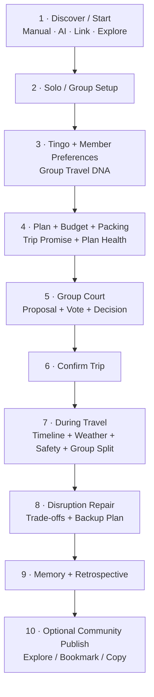
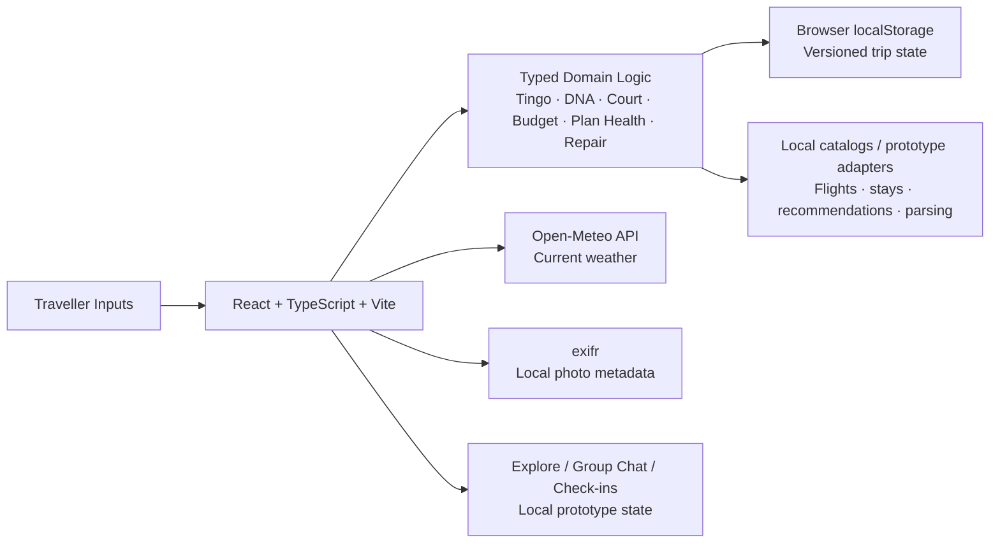
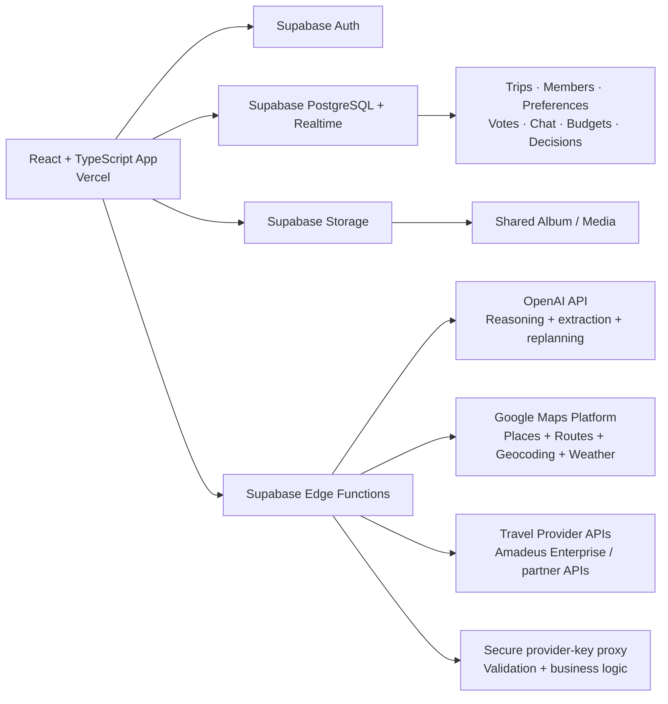

# 🥥 CocoCrunch by NJHL

  <strong>A transparent travel-planning companion that turns different preferences, budgets, and unexpected changes into one plan everyone can stand behind.</strong>

  
  
  
  

  <strong>Plan together. Decide transparently. Recover gracefully.</strong>

---

## 📌 Submission Information

| Required item | Details |
| --- | --- |
| **Project Name** | CocoCrunch |
| **Team** | **NJHL** — Wong Jia Hui, Lee Mei Shuet, Bong Zi Shan, Jasmine Khoo Jia Chee |
| **Problem Statement** | Lifestyle Track — Planning an Escape: **Travel Planner** |
| **Public GitHub Repository** | [github.com/meishuet16/CocoCrunch_GO](https://github.com/meishuet16/CocoCrunch_GO) |
| **Video Presentation** | — |
| **Presentation Slides** | — |
| **UI Prototype / Deployed App** | — |
| **Ideation Boards** | Embedded in [Section 2.2](#22-ideation-boards) |

### Quick Navigation

[**Project Overview**](#1-project-overview) ·
[**Ideation & Process**](#2-ideation--process) ·
[**Design & Prototype**](#3-design--prototype) ·
[**What Makes It Different**](#4-what-makes-cococrunch-different) ·
[**Technical Architecture & Feasibility**](#5-technical-architecture--feasibility)

---

# 1. Project Overview

## 1.1 The Problem

Planning a trip means coordinating **flights, accommodation, budgets, activities, schedules, and different preferences**—often across several apps and a group chat. The difficulty becomes much greater for group travel because everyone may have different priorities, spending limits, pacing, accessibility needs, and non-negotiable activities.

The deeper problem is not simply “making an itinerary.” It is keeping the whole trip **coherent before, during, and after changes happen**.

### Why the problem happens

| Root cause | What travellers experience |
| --- | --- |
| **Fragmented planning** | Booking details, budgets, activity ideas, and group discussions live in separate places. |
| **Different preferences** | The organiser has to remember what everyone wants, while quieter members can be overlooked. |
| **Budget misalignment** | A plan may look exciting but fail when members have different spending limits. |
| **Late conflict** | Disagreement appears after time has already been spent planning—or after bookings are made. |
| **Poor disruption recovery** | A delay, cancellation, weather change, or closed attraction can break the day and force manual replanning. |
| **Single-person coordination burden** | One organiser often carries the invisible work of updating and reconciling the plan. |
| **Planning from a blank page** | Travellers often see good ideas on social platforms or from other travellers but must manually rebuild them inside a planning tool. |

### Stakeholders

| Stakeholder | Need |
| --- | --- |
| **Solo travellers** | A realistic plan that reflects personal interests, pace, constraints, and budget. |
| **Group members** | A fair way to express preferences and participate in decisions. |
| **Trip organisers** | Less manual coordination and fewer repeated discussions. |
| **Family / trusted contacts** | Reassurance when appropriate without requiring continuous location tracking. |
| **Travel community members** | A controlled way to share useful completed trips and reuse proven ideas. |

### Existing solution and the gap

Tools such as **TripIt** are useful for consolidating booking confirmations into an itinerary. However, itinerary consolidation does not fully solve the earlier and messier part of travel: **aligning preferences, handling trade-offs, reaching agreement, learning from other travellers, and recovering together when plans change**.

CocoCrunch focuses on that gap.

> **Core problem statement:**  
> How might we help solo and group travellers move from scattered inspiration, preferences, bookings, and constraints to one realistic trip that can still adapt transparently when reality changes?

---

## 1.2 Our Solution

**CocoCrunch** is a mobile-first travel-planning application that supports the journey from inspiration to planning, travelling, and post-trip reflection. Travellers can start from their own destination, an AI-assisted recommendation flow, an external travel link, or a public trip shared by another traveller. The app then brings preferences, budget, itinerary, group decisions, packing, live trip support, memories, and disruption recovery into one connected experience.

Instead of allowing AI or one organiser to silently rewrite a shared plan, CocoCrunch explains recommendations, protects important commitments, and gives the group a clear decision path. Its companion, **Coco**, acts as a guide and explanation layer rather than an invisible decision-maker.

### Core Feature Set

| Feature | User problem solved | How CocoCrunch addresses it |
| --- | --- | --- |
| 🧭 **Tingo Travel Profile** | Generic itineraries ignore how differently people travel. | A 16-type assessment shapes pace, recommendation bias, packing preferences, and planning guidance. |
| ✈️ **Solo & Group Trip Setup** | Trip context is scattered across messages and notes. | Captures destination, dates, Trip Vibe, budget, Must-Go anchors, Deal Breakers, and member preferences. |
| 🔗 **External Inspiration Import** | Travellers find ideas on social/travel platforms but must manually recreate them. | Users can paste an external travel link as a starting point for destination planning. The current prototype demonstrates the parsing flow locally; live webpage extraction belongs to the connected architecture. |
| 🌍 **Explore / Community & Trip Sharing** | Planning in isolation misses proven ideas from other travellers. | Users can browse and bookmark public trips, copy a shared trip as a planning starting point, and explicitly publish completed trips. Trip publication is opt-in, and memory cards/photos have separate per-item privacy controls. |
| 🧬 **Group Travel DNA** | Group planning can reflect the loudest person rather than the whole group. | Surfaces shared signals, budget ranges, different preferences, and unresolved conflicts rather than averaging them away. |
| ⚖️ **Group Court** | One person can otherwise change a shared plan without consent. | Supports proposals, voting, concessions, confirmed decisions, and tie-only Gacha. Losing but viable options can remain available as Backup Plans. |
| 🤝 **Trip Promise** | Important personal commitments can disappear when an itinerary is optimised. | Makes protected commitments explicit so AI-assisted planning and later adjustments treat them as constraints rather than disposable suggestions. |
| 💚 **Plan Health** | Attractive itineraries may still be unrealistic. | Evaluates timing, buffers, budget, pace, and protected commitments to explain where the plan is strong or fragile. |
| 💰 **Budget & Retrospective** | Planned and actual spending are rarely compared meaningfully. | Tracks category budgets, planned-versus-actual values, and post-trip reflection. |
| 🗓️ **Schedule & Timeline Control** | Travellers need flexibility instead of being locked into an AI-generated schedule. | Users can manually reorder the plan while the system keeps the itinerary context and trade-offs visible. |
| 🧳 **Packing / Luggage Planner** | Packing is usually disconnected from the trip itself. | Generates a packing checklist from saved packing preferences, destination context, trip duration, and weather conditions; users can tick and manage items in a dedicated luggage interface. |
| 🔄 **Disruption Repair** | Delays or changes force manual replanning under pressure. | Previews what changes, what remains protected, and which Backup Plan can fit before the user confirms the adjustment. |
| 🛡️ **Safety, Check-ins & Group Split** | Travellers want reassurance and practical help without default surveillance. | Supports multiple emergency contacts, per-contact permissions for location/message sharing, configurable check-in frequency, and status-only check-ins. During group travel, Group Split can define who separates, where they are going, and a meeting point/time; nearby hospital, pharmacy, and luggage-storage help can also be opened from the trip tools. |
| 💬 **Group Channel** | Group context and decisions are easily lost in another messaging app. | Keeps trip discussion and Group Court notifications close to the shared plan so context can support later decisions. |
| 📸 **Shared Album, Memory & Learning** | Planning often stops when the itinerary is created. | Stores trip moments, photo metadata, completed-trip reflections, decision history, planned-vs-actual comparisons, and opt-in public memories for Explore. |

---

## 1.3 Target Users

### Primary target

**University students and young adults travelling alone or in small groups** who are price-conscious, discover travel ideas online, plan collaboratively through chat, and need to coordinate different interests without turning one friend into the permanent organiser.

### Secondary target

Families, couples, and other small travel groups that need a shared itinerary, clearer trade-offs, safer check-ins, and easier recovery when plans change.

### Why CocoCrunch fits them

- They often have **different budgets and priorities**.
- Decisions are frequently made through **messaging apps**, where important constraints disappear in long conversations.
- Travel inspiration often begins on **social/community content**, but turning inspiration into a real plan takes extra work.
- Their plans can be sensitive to **delays, transport changes, weather, or attraction availability**.
- They benefit from a tool that reduces coordination effort without removing human control.

---

## 1.4 Before → CocoCrunch → After

| Before CocoCrunch | With CocoCrunch | Expected user outcome |
| --- | --- | --- |
| Travel ideas are scattered across social links, saved posts, apps, and chat. | External-link entry and Explore provide reusable starting points. | Less rebuilding from scratch. |
| Preferences are buried in chat. | Preferences and constraints are captured explicitly. | Less repeated discussion and fewer forgotten needs. |
| The organiser manually combines everyone's ideas. | Group Travel DNA surfaces alignment and conflict. | The group sees where agreement exists and where a decision is needed. |
| One person edits the itinerary. | Group Court separates suggestions from official changes. | Shared changes become visible and accountable. |
| Packing happens in a separate notes app or memory. | Packing is generated from the trip context. | Preparation stays connected to destination, duration, and conditions. |
| A disruption breaks the whole day. | Repair previews protect anchors and reuse backup options. | Faster recovery with fewer accidental losses. |
| Safety updates can require constant location sharing. | Check-ins and emergency-contact permissions are controlled separately. | Reassurance without default surveillance. |
| Useful completed trips disappear after the holiday. | Memory and Explore turn selected trip knowledge into reusable inspiration. | Travellers can reflect, share selectively, and help others plan. |

### Product Principles

1. **AI suggestions are proposals, not execution.** Important changes need explanation, preview, confirmation, and—where appropriate—undo.
2. **Trip Promise protects what matters.** Must-Go items and human commitments remain visible constraints during planning and repair.
3. **Group governance stays explicit.** Saving a personal idea is different from changing the official group plan.
4. **Randomness has a narrow role.** Gacha is used only for a genuine tie or low-stakes indecision.
5. **Privacy is intentional.** Community publishing, photo visibility, emergency check-ins, and location sharing are separate choices.
6. **Community sharing is opt-in.** A completed trip remains private unless the traveller explicitly publishes it.

---

# 2. Ideation & Process

## 2.1 Ideas We Considered

We began with a broad question:

> **“Why does planning a group trip still feel like managing several disconnected apps and a group chat?”**

Instead of committing immediately to one itinerary generator, we explored different ways to solve the challenge.

| Idea | Decision | Why it was kept / dropped |
| --- | --- | --- |
| **Shared trip-planning workspace** | ✅ **Kept** | Combines destination, constraints, itinerary, budget, preparation, and decisions into one journey. |
| **Tingo profile + Group Travel DNA** | ✅ **Kept** | Makes individual preferences visible before they become conflict. |
| **Group Court decision flow** | ✅ **Kept** | Makes changes to the shared plan accountable instead of allowing silent edits. |
| **Backup Plan + disruption repair** | ✅ **Kept** | Directly addresses the need to adapt when plans change unexpectedly. |
| **Explore / public trip community** | ✅ **Kept** | Lets travellers reuse completed real trip structures instead of always starting from zero. |
| **External travel-link entry** | ✅ **Kept** | Turns inspiration found elsewhere into a direct entry point for planning. |
| **Packing integrated with trip context** | ✅ **Kept** | Connects preparation to destination, trip length, weather, and personal packing habits. |
| **Safety check-ins without default tracking** | ✅ **Kept** | Supports reassurance while preserving privacy and user control. |
| Generic AI-generated itinerary only | ❌ **Dropped** | Generates ideas but does not solve coordination, consent, preparation, or accountability. |
| Random Gacha for official decisions | ❌ **Dropped as primary mechanism** | Chance should not replace consent; it only remains for a true unresolved tie. |
| Continuous location tracking | ❌ **Dropped as default** | Reassurance should not require surveillance. |
| Social feed as the whole product | ❌ **Dropped** | Community is useful as an input/output layer, but the core product must still solve planning and recovery. |

---

## 2.2 Ideation Boards

We used **5 Whys** to trace visible travel-planning frustrations back to their root causes, then used **Crazy Eights** to explore multiple possible solution directions before narrowing the concept. The diagrams below consolidate those outputs into the final problem map, idea-evolution path, and selected user flow.

### Problem Map — Mindmap + 5 Whys

### Idea Exploration & Evolution — Crazy Eights → Refinement

The early exploration included multiple directions such as a generic AI itinerary generator, a social-feed-first product, continuous location sharing, and randomised group decisions. These were compared and either refined, narrowed, or dropped before the current concept was selected.

### Selected End-to-End User Flow

---

## 2.3 Mentor Consultation

We consulted **two mentors** and used their feedback to refine both the product and the way we communicate its value.

| Date | Mentor | Feedback Received | What We Changed / Decision Taken |
| --- | --- | --- | --- |
| **6/9/2026** | **Lim Zi Yang** | Suggested adding a **Shared Album**. Recommended making the pitch comparison clearer by highlighting the **four strongest special features**, using concise bullet points to show how they differ from existing solutions. Also suggested integrating external travel-company APIs such as flight, ticket, or booking APIs to create stronger business and partnership potential. | Added the **Shared Album** to the post-trip experience. Refocused the pitch around four signature features and strengthened the comparison with existing travel tools. Added external travel-provider integration to the target technical architecture for flights, hotels, activities, tickets, and booking handoffs. |
| **9/9/2026** | **Marcus Mah Qing Fung** | Recommended reducing the number of features and titles so the core value is clearer. Identified **Group Court** as a strong feature worth keeping. Suggested allowing users to manually adjust schedules and timelines, focusing more on how AI performs trade-offs during schedule changes, and using **group chat** to gather richer context. | Reduced and grouped lower-priority concepts while keeping **Group Court** as a core differentiator. Strengthened manual timeline editing and the target AI trade-off flow around time, budget, preferences, Trip Promise anchors, and disruption context. Added group chat as part of the shared trip experience. |

---

# 3. Design & Prototype

## 3.1 UI Prototype

**Public app / UI prototype:** —

## 3.2 End-to-End Prototype Journey

## 3.3 Visual Direction & UX

CocoCrunch uses a **warm travel-journal / scrapbook** direction rather than a generic dashboard. Cream paper surfaces, Sangria accents, postcard-like details, travel stamps, maps, luggage motifs, and Coco’s context-aware poses give the experience personality while keeping decision-critical information prominent.

| Design element | Direction |
| --- | --- |
| **Visual mood** | Warm, personal, travel-journal inspired |
| **Primary surfaces** | Cream / paper-like backgrounds |
| **Accent** | Sangria / deep red for emphasis and decision states |
| **Illustration / companion** | Coco appears contextually across planning, packing, travelling, and memory stages |
| **Information hierarchy** | Status, budget, approval state, trip impact, and privacy state appear before decoration |
| **Layout** | Mobile-first cards and progressive disclosure |
| **Interaction** | Clear proposal → impact → decision flow |
| **Community privacy** | Publish trip, publish memories, and keep private are separate user choices |

### UX Rules

- **Explain before asking the user to decide.**
- **Never hide group disagreement behind an average.**
- **Keep official-plan changes visually distinct from personal saves.**
- **Protect Trip Promise anchors unless the user explicitly changes them.**
- **Always show the effect of a disruption repair before confirmation.**
- **Keep public sharing opt-in and granular.**
- **Keep safety reassurance separate from default continuous tracking.**

---

# 4. What Makes CocoCrunch Different

CocoCrunch is not positioned as “another AI itinerary generator.” Its core difference is the combination of **preference-aware planning, group governance, explainable trade-offs, and disruption recovery** inside one end-to-end journey.

## 4.1 The Difference in One Scenario

Imagine a group has a rooftop dinner booked for **7:00 PM**, but their flight lands **90 minutes late**.

A group chat usually produces a rushed decision: someone edits the plan, others notice later, and the group may lose an activity someone cared about.

CocoCrunch handles the same event as a transparent decision:

1. Detect or receive the disruption.
2. Protect confirmed **Trip Promise / Must-Go** anchors.
3. Show the time, cost, travel, and preference impact of a repair.
4. Reuse a viable **Backup Plan** where possible.
5. Route a shared-plan change through the correct decision flow.
6. Confirm the change before it becomes official.
7. Preserve the decision history for later reflection.

---

## 4.2 Four Signature Features

| Signature feature | What makes it different |
| --- | --- |
| 🧬 **Group Travel DNA** | Combines member preferences while keeping conflicts and different priorities visible instead of averaging them away. |
| ⚖️ **Group Court** | Gives important shared-itinerary changes a transparent proposal, voting, and confirmation path. |
| 🧠 **AI Trade-off Schedule Adjustment** | The target connected version evaluates time, budget, preferences, travel distance, live conditions, and protected anchors before proposing a schedule change rather than simply regenerating the itinerary. |
| 🔄 **Disruption Repair + Backup Plan** | Helps the group recover when the original itinerary breaks while protecting important plans and reviving viable alternatives that the group has already considered. |

---

## 4.3 Differentiation from Existing Solutions

| Dimension | Typical itinerary / booking organiser | CocoCrunch |
| --- | --- | --- |
| **Starting point** | User manually enters a new trip | Manual setup, recommendation flow, external-link entry, or copy from Explore |
| **Preference conflict** | Often handled outside the app | Made visible through Group Travel DNA |
| **Official group changes** | Usually editable by the organiser | Proposed and confirmed through Group Court |
| **Important commitments** | Often manually remembered | Trip Promise keeps them explicit and protected |
| **Preparation** | Packing often sits outside the itinerary app | Packing is generated from the trip context |
| **AI adjustment** | Often produces a fresh recommendation | Designed around visible trade-offs and protected constraints |
| **Disruption response** | User manually rebuilds the plan | Repair flow prioritises protected anchors and Backup Plans |
| **Safety** | Location sharing may be all-or-nothing | Contact-by-contact permissions and status-only check-ins |
| **Community** | Inspiration may be separate from planning | Completed public trips can be bookmarked or copied into a new trip |
| **Post-trip value** | Trip ends when the itinerary ends | Memories, budget reflection, decision history, and optional community sharing continue the loop |

---

# 5. Technical Architecture & Feasibility

## 5.1 Current Prototype Architecture

The public repository currently implements a **frontend-first prototype**. The product logic and major journeys are real React/TypeScript interactions, while services that would require private credentials, multi-user infrastructure, or commercial travel-provider access are represented through local adapters and labelled prototype data.

### Current Implementation

| Area | Current repository implementation | Why it fits the prototype | Constraint |
| --- | --- | --- | --- |
| **Frontend** | **React + TypeScript + Vite** | Component-based, typed, and suitable for a responsive interactive prototype. | Browser application only. |
| **UI & Interaction** | **dnd-kit, Lucide React, CSS, uisfx** | Supports drag/reorder interactions, visual controls, motion, and lightweight feedback. | Interaction state is local to the current app instance. |
| **Planning / Governance Logic** | **Typed TypeScript domain modules** | Keeps Tingo, Group Travel DNA, Group Court, budget, Plan Health, itinerary, learning, and repair logic testable outside UI components. | Does not provide server authority for multiple real users. |
| **Persistence** | **Browser localStorage** | Preserves the prototype journey across browser sessions without requiring a backend. | Data is device/browser scoped and not suitable for real multi-user collaboration. |
| **Live API** | **Open-Meteo geocoding + weather** | Provides real current weather context without pretending all travel data is live. | Weather does not automatically alter the itinerary. |
| **Photo Metadata** | **exifr** | Reads local photo metadata for the Memory experience without uploading photos to a server. | Local metadata availability depends on the photo. |
| **Explore / Community** | **Local public-trip data + publish/privacy logic** | Demonstrates browse, bookmark, copy, publish/unpublish, and per-memory privacy interactions. | Community content is not stored in a shared production database. |
| **External-link Entry** | **Local prototype parser** | Demonstrates the UX for starting a trip from a shared travel link. | The current code does not fetch or read the linked webpage. |
| **Flight / Accommodation** | **Prototype confirmation-text parsers + mock partner catalogs** | Demonstrates already-booked and not-yet-booked flows. | Quotes, inventory, voucher codes, and booking handoffs are not live. |
| **Group Chat / Voting** | **Local prototype state** | Demonstrates channel messages, Court notifications, voting, and decisions. | No real-time cross-device synchronisation. |
| **Safety / Check-ins** | **Local contact, permission, frequency, Group Split, and nearby-help flows** | Demonstrates granular privacy and during-trip UX. | No real SMS/location sending and no live member-location midpoint calculation. |
| **Backend** | **None in the current repository** | Keeps the prototype deployable as a frontend application. | Authentication, secure secrets, shared data, and multi-device collaboration require a backend. |
| **Database** | **None; browser state is used instead** | Sufficient for prototype persistence. | Not scalable for shared production trips. |
| **Hosting** | **Static Vite web build** | Can be deployed to a static host such as Vercel. | Production provider secrets cannot safely live in the browser. |

---

## 5.2 Target Connected Architecture

The production-connected architecture keeps the same React product layer but moves shared state, authentication, provider credentials, AI requests, and realtime collaboration behind a backend.

### Target Tech Stack

| Area | Technology / service | Role in the connected app | Main constraint |
| --- | --- | --- | --- |
| **Frontend** | **React + TypeScript + Vite** | Retains the current interface and typed client-side experience. | Requires careful separation between client state and server-authoritative state. |
| **Backend** | **Supabase Edge Functions** | Holds secure business logic, validates requests, and proxies AI/travel-provider calls so secret keys never ship to the browser. | Function quotas, latency, and provider error handling must be managed. |
| **Database** | **Supabase PostgreSQL** | Stores users, trips, member preferences, itineraries, Group Court records, budgets, chat, community publishing state, and retrospective data. | Requires schema design and row-level access policies. |
| **Authentication** | **Supabase Auth** | Replaces prototype OTP screens with real authenticated user sessions. | Production phone OTP can add SMS-provider cost and abuse controls. |
| **Realtime Collaboration** | **Supabase Realtime** | Synchronises group chat, Court votes, itinerary state, and shared-trip updates across devices. | Conflict handling and permissions are required for simultaneous edits. |
| **File / Media Storage** | **Supabase Storage** | Stores Shared Album media and applies trip/member access rules. | Photo privacy, storage cost, and upload limits must be controlled. |
| **AI** | **OpenAI API** | Supports itinerary reasoning, group-context summarisation, external-content extraction after backend retrieval, and trade-off-aware schedule repair. | Cost, latency, structured-output validation, and hallucination control require deterministic guardrails. |
| **Maps / Places / Routes** | **Google Maps Platform** | Supplies place search/details, geocoding, routes/travel time, and connected weather context. | Usage is billed and requires API-key restrictions/quotas. |
| **Travel Inventory / Booking Handoff** | **Amadeus Enterprise APIs or an equivalent approved partner API** | Replaces mock flight/hotel/activity catalogs with live search/availability and booking handoffs. | Access is provider-dependent; commercial terms, quotas, and supported booking flows vary. |
| **External Travel-Link Import** | **Backend URL ingestion + source-aware extraction + OpenAI parsing** | Turns supported external inspiration into structured destination/place suggestions. | Must respect each source's access rules; arbitrary sites cannot be assumed scrapeable. |
| **Frontend Hosting** | **Vercel** | Hosts the React/Vite frontend with preview and production deployments. | Environment variables still require server-side handling for secrets. |
| **Backend Hosting** | **Supabase Cloud** | Hosts database, Auth, Realtime, Storage, and Edge Functions. | Free/paid limits must match usage as the product scales. |

---

## 5.3 Build Plan & Scope

The building phase focuses first on preserving the complete end-to-end user journey, then replacing prototype adapters with the highest-value connected services.

| Phase | Scope |
| --- | --- |
| **Week 1 — Core Product Journey** | Stabilise onboarding, Tingo, solo/group setup, Explore entry, preferences, Group Travel DNA, itinerary, budget, Trip Promise, packing, Group Court, and local persistence. |
| **Week 2 — During & Post-trip Experience** | Complete manual timeline editing, disruption repair, Backup Plan, check-ins, emergency contacts, Group Split, group channel, Shared Album, Memory, retrospective, and community publishing/copy flow. |
| **Week 3 — Connected Services & Deployment** | Prioritise backend/authentication, secure AI/provider calls, shared data/realtime collaboration, travel/maps integrations that are achievable within provider access, then test and deploy the final web app. |

### Scope Priority

**Core submission scope:** the full before → during → after journey, including group planning, governance, packing, disruption repair, safety, memory, and Explore.

**Highest-priority live integrations:** authentication/shared data, AI trade-off reasoning, maps/routes, and selected travel-provider data.

**Provider-dependent scope:** direct booking/checkout, arbitrary external-site parsing, and commercial inventory depend on API access and are implemented only where the provider permits it.

### Resource & Time Awareness

NJHL is a **four-member student team working within a three-week development period**, so we prioritise a complete end-to-end journey before replacing every prototype adapter with a live service.

| Constraint | Impact on the project | Our response |
| --- | --- | --- |
| **Limited development time** | Connecting every service at once could leave the core journey incomplete. | Build and validate the full before → during → after experience first, then connect the highest-value services. |
| **Small team size** | Design, frontend development, testing, integration, and presentation work compete for the same capacity. | Keep ownership focused and reuse a consistent typed domain model across the product. |
| **API access & commercial approval** | Live travel inventory, booking, and some external platforms may require approval, quotas, or partner agreements. | Keep provider-dependent capabilities behind adapters so the core product remains demonstrable even when a live provider is unavailable. |
| **Usage cost** | AI, maps, storage, messaging, and travel-provider services can introduce usage-based fees. | Start with free or low-cost tiers where suitable, limit unnecessary requests, and prioritise integrations with the clearest user value. |
| **Privacy & security** | Location, emergency contacts, group chat, and shared photos contain sensitive user data. | Keep sharing opt-in, separate permissions by feature/contact, and move secrets and protected data behind authenticated backend services in the connected architecture. |

This keeps the scope **ambitious but buildable**: the current prototype demonstrates the complete product logic and journey, while the target architecture shows how live services can be added responsibly when time, budget, and provider access allow.

---

## 5.4 Reach & Scalability

CocoCrunch can begin with **solo travellers and small friend groups**, where planning friction is easy to observe, and expand to families and larger travel groups without changing its core model.

The scalable asset is not only the itinerary. It is the connected structure of **preferences → protected commitments → proposals → decisions → adjustments → memories → reusable public trips**.

With the target architecture, shared state moves from one browser into authenticated database records, group events become realtime, media moves into access-controlled storage, and travel providers sit behind backend adapters. This allows CocoCrunch to grow from student and friend-group travel into family and larger-group use cases, while adding new destinations, partners, and provider integrations without redesigning the core journey.
